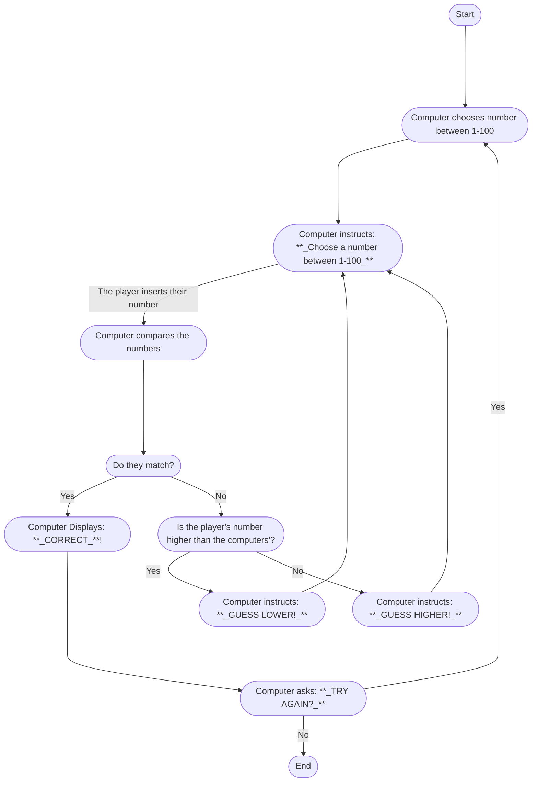

The first batch of lines lay out the general process that will happen when the game starts. The computer chooses a number between 1 - 100, asks the player to choose a number in the same range and type it in, and finally the computer will check if they match.

The second batch of lines are for the scenario of the player guessing the number correctly, the game will tell them they are correct, and ask if they wnat to play again, if the player says no, the game ends, if they say yes then the whole process starts again.

The last batch are for when the player guesses wrong, and depending if the number the player chose is higher or lower than the computers', the player will be informed to guess lower or higher and the player would then have to type their number again.
