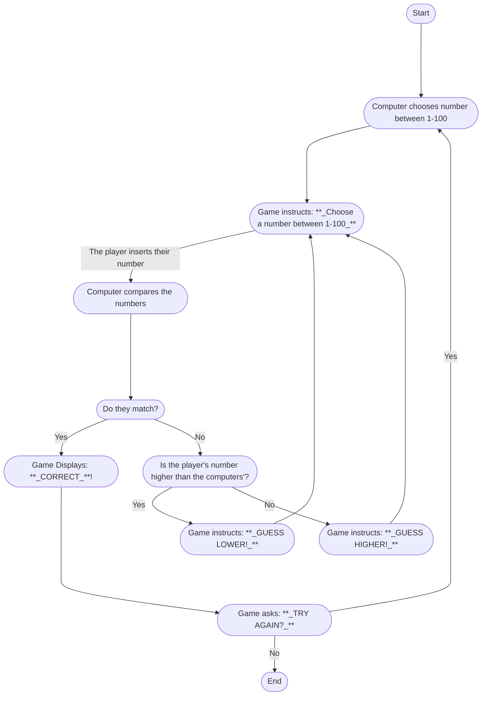

When the game starts, the computer will choose a random number between 1 and 100.

Then the game will tell the player to choose a number in the same range.

Once the players inserts their number, the computer will compare both numbers to see if they match.

* If they do, the game will tell the player they are correct and ask if they want to play again. If they don't want to, the game ends. If they do, they are the whole process starts over.

* If the numbers don't match, the computer will see if the player's num,ber is higher or lower that the computer's.
	* If it's higher, the game will tell the player to guess a number lower than the one before and are asked to type it in again.
	* If it's lower, than the payer is told to choose a number higher than the before, and are asked to type in their number again.
